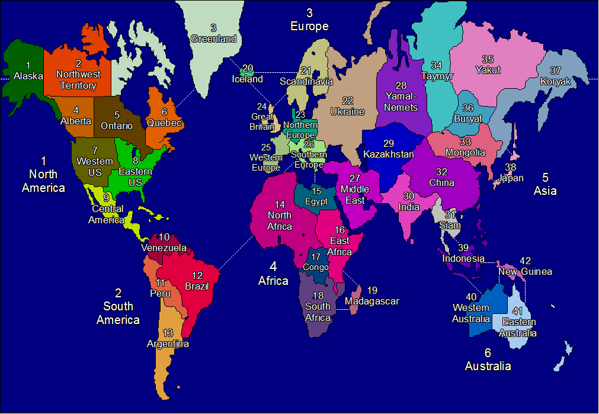
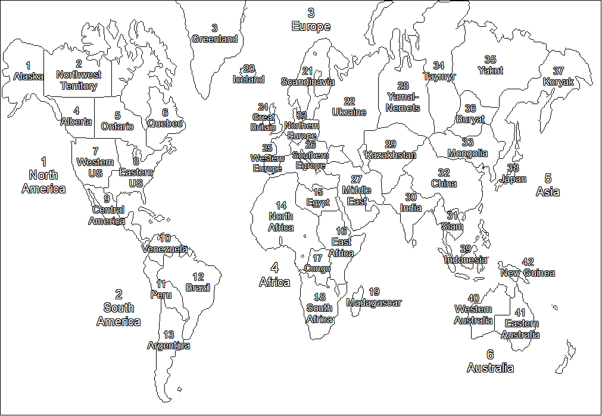

# TRP conversion reference

This folder contains the legacy guide for converting TurboRisk 1.2 player
scripts to the Pascal Script format used by later TurboRisk versions, its
stylesheet, the accompanying numbered territory maps, and the compiled
TurboRisk help file.

- [Converting TRP from version 1.2](converting%20TRP%20from%20version%201.2.html)
- [Stylesheet](turborisk.css)
- [TurboRisk help file](TurboRisk.chm)
- [TRP bot strategies](HelpSource/bot_strategies.htm)

The conversion guide links to `programs.html`, which was not included with the
provided files. The current callback declarations and compile workflow are
documented in [TRComp.md](../TRComp.md).

## Rebuilding TurboRisk help

`HelpSource` contains the HTML source, table of contents, and assets used by
the compiled help file. From the repository root, rebuild it with:

```powershell
chmcmd .\Doc\HelpSource\TurboRisk.hhp
```

This writes `Doc\TurboRisk.chm`. The TRP bot strategy descriptions are
available in the [bot strategy topic](HelpSource/bot_strategies.htm).

## Numbered territory maps

Use these maps when identifying territory numbers in a TRP script:




